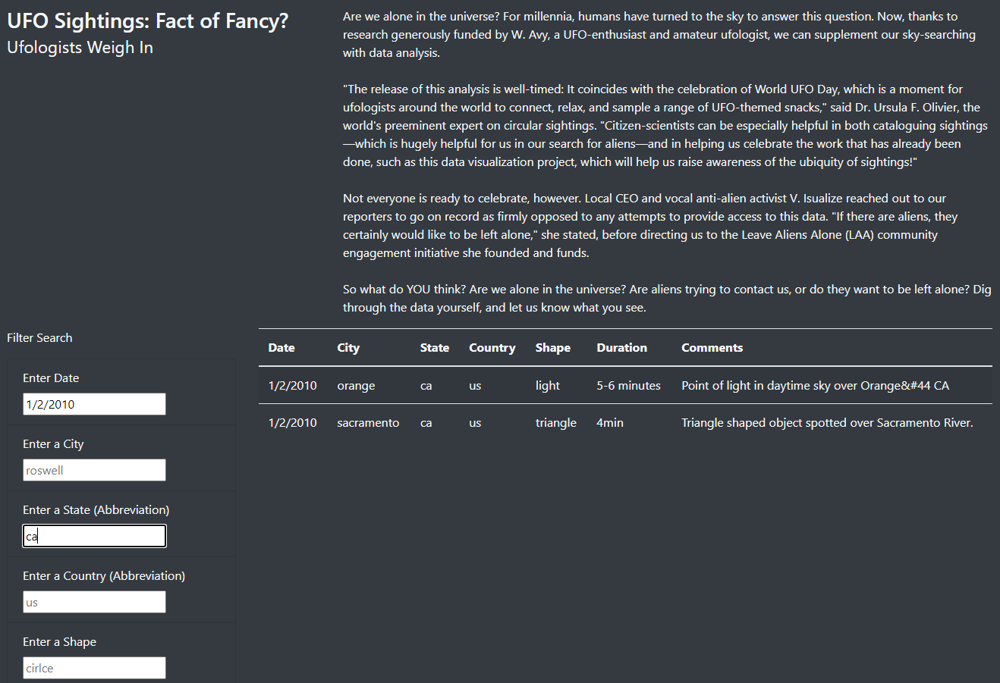
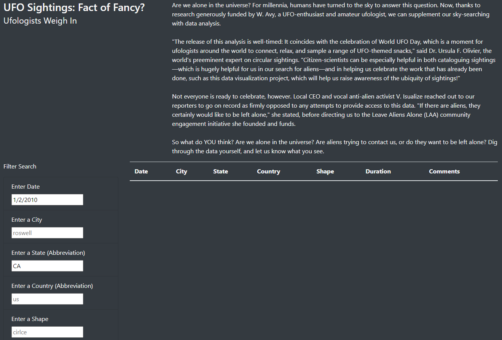

# UFOs
JavaScript, Bootstrap, and UFO's

## Overview of analysis:
The purpose of this analysis is to create a webpage that takes data for UFO sightings and puts them into a table. The webpage viewer can then input
the search criterias of date, city, state, country, and shape of the UFO to only show the filtered criteria in the table.

## Results:
The webpage is able to filter the data with one or more of the criteria. There are 5 search boxes on the webpage that users can input which filters
they want to see. The javascript code listens for any event that users input into any of the search boxes. Once an input is entered, the user can press
the Enter key on their keyboard or click outside of the search box to have the table automatically filter with the results. See the following image 
for how the table filters when the search criterias of the date (1/2/2010) and the state (ca) are entered.

## Summary
It is important to know that the search boxes are limted by the fact the need to be searched with all lowercase letters and can only be searched by exact
spelling on the data table. Here is the same search criterias as the image below, but the table doesn't show data since I searched the state as "CA" instead
of "ca".

Because of this limitation, it would be recommended to update the code so that upper case letters are automatically converted to lower case. I would also
recommend updating the code so that error messages appear to the user if they input something that doesn't match on the table exactly. These are two things
that should help the end user have a much better experience when visiting the webpage.
